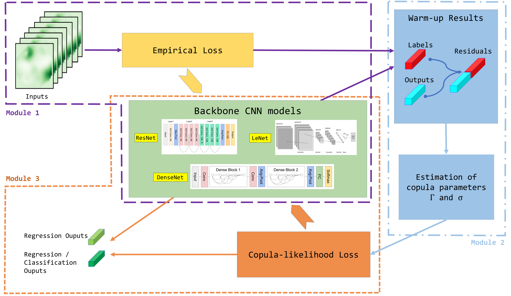

# CeCNN: Copula-enhanced Convolutional Neural Networks in Joint Prediction of Refraction Error and Axial Length based on Ultra-widefield Fundus Images

<!--
 
-->

The code and the supplement material for paper "CeCNN: Copula-enhanced convolutional neural networks in joint prediction of refraction error and axial length based on ultra-widefield fundus images’’.
 - Warmup_RC_simulation.py & Warmup_$$RR_simulation.py: Warm-up CNN module where we train the backbone CNNs under empirical loss (Module 1).
 - Copula_RC_simulation.py & Copula_RR_simulation.py: Copula estimate module where we retrain the CeCNN models from above module with the proposed copula loss (Module 3). 
 - CeCNN_Supplement.pdf: Including technical proof and additional experiments.

The complete architecture for applying the CeCNN model to the UWF dataset is illustrated above with three modules:
1. Initially, we trained the backbone CNNs and obtained the residuals from their outputs (Module 1). 
2. Then, using both the outputs and residuals, we computed estimates of the copula parameters and the correlation matrix (Module 2).
3. With the correlation matrix and residuals, we proceeded to train our CeCNN models with the proposed copula loss (Module 3). When training our CeCNN model, we used the network parameters from the previously pre-trained backbone CNN as the initial parameters of CeCNN.

## Requirement
#### Hardware
OUCopula requires only a standard computer with enough RAM and a NVIDIA GPU to support operations. We use the following specs:

    CPU: 16 vCPU Intel(R) Xeon(R) Platinum 8352V CPU @ 2.10GHz/core
    RAM: 90GB
    GPU: NVIDIA RTX 4090(24GB)

#### Python package
    python        == 3.8.10
    pandas        == 2.0.3
    numpy         == 1.24.2
    aioitertools  == 0.11.0
    scikit-learn  == 1.3.2
    torch         == 2.0.9+cu118
    seaborn       == 0.13.0

## Disclaimer
This code is for research purposes and is not approved for clinical use.

## Contact
If you have any questions, please contact us via email:
* [Chong Zhong](chzhong@polyu.edu.hk)
* [Yang Li](18110980006@fudan.edu.cn)